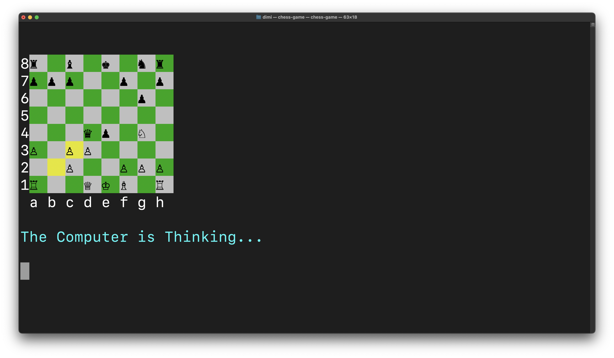

# Terminal Chess Game

A terminal-based chess game developed in C#. This project was an 11th grade, high school group project, focused on implementing a Player vs. Computer chess experience using the **Minimax algorithm** for the AI. We focused on core game logic within the constraints of limited C# features, as we weren't permitted to use Object-Oriented Programming (OOP) concepts.

---

## Features

* **Player vs Computer AI:** Challenge a computer opponent powered by the Minimax algorithm.
* **Standard chess rules:** All the familiar moves, captures, and special rules (castling, en passant, pawn promotion) are implemented.
* **Clear terminal interface:** Easy-to-read board and game state, even in a console window.

---

## How to Run

The easiest way to play is by using the pre-built executable. You won't need Visual Studio or even to install the .NET SDK!

### 1. Download the Game

* Go to the [**Releases**](https://github.com/Dimi15/terminal-chess-game/releases) section of this repository.
* Download the `.zip` or `.tar.gz` file for your operating system:
  - `win-x64.zip` for Windows
  - `linux-x64.tar.gz` or `linux-musl-x64.tar.gz` for Linux
  - `osx-x64.zip` for macOS (Intel)
  - `osx-arm64.zip` for macOS (Apple Silicon)

### 2. Extract and Play!

* **Windows:**
    * Unzip the downloaded file.
    * Navigate into the extracted folder.
    * **Double-click** `chess_game.exe` to start the game.
* **Linux/macOS:**
    * Unpack the downloaded archive (e.g., `osx-64.zip`).
    * Open your terminal, navigate to the extracted folder.
    * First, give execute permissions:
        ```bash
        chmod +x chess_game
        ```
    * Then, run the game:
        ```bash
        ./chess_game
        ```

---

## Troubleshooting: Missing Chess Pieces?

If you run the game and don't see the chess pieces (they might appear as squares, question marks, or garbled text), it's likely that your terminal's font doesn't support the **Unicode characters** used for the pieces.

To fix this, you'll need to change your terminal's font to one that supports a wide range of Unicode symbols. We highly recommend using **DejaVu Sans Mono**.

Here's how you typically change the font in common terminals:

* **Windows Terminal (Recommended for Windows):** Open Settings (`Ctrl + ,`), navigate to "Profiles" -> "Defaults," and under "Text" -> "Font face," select a suitable font.
* **Windows Command Prompt/PowerShell:** Right-click the title bar, select "Properties," go to the "Font" tab, and choose a Unicode-supporting font like "DejaVu Sans Mono".
* **Linux/macOS Terminals (e.g., GNOME Terminal, iTerm2, Kitty):** Look for "Preferences" or "Settings" in your terminal application's menu, find the "Profiles" or "Appearance" section, and change the font there.

---

## Documentation

For a comprehensive guide on how the program is structured, please download our project documentation (written in italian):

* [**Download Documentation (PDF)**](https://github.com/Dimi15/terminal-chess-game/blob/80c0fb133316b23169fab5690ba1fad4a8b5a5f5/docs/documentation.pdf)


---

<p align="center">
  
  
  
</p>
<p align="center">
  
  
</p>

---

## License

This project is licensed under the MIT License. See the [LICENSE](LICENSE) file for details.
